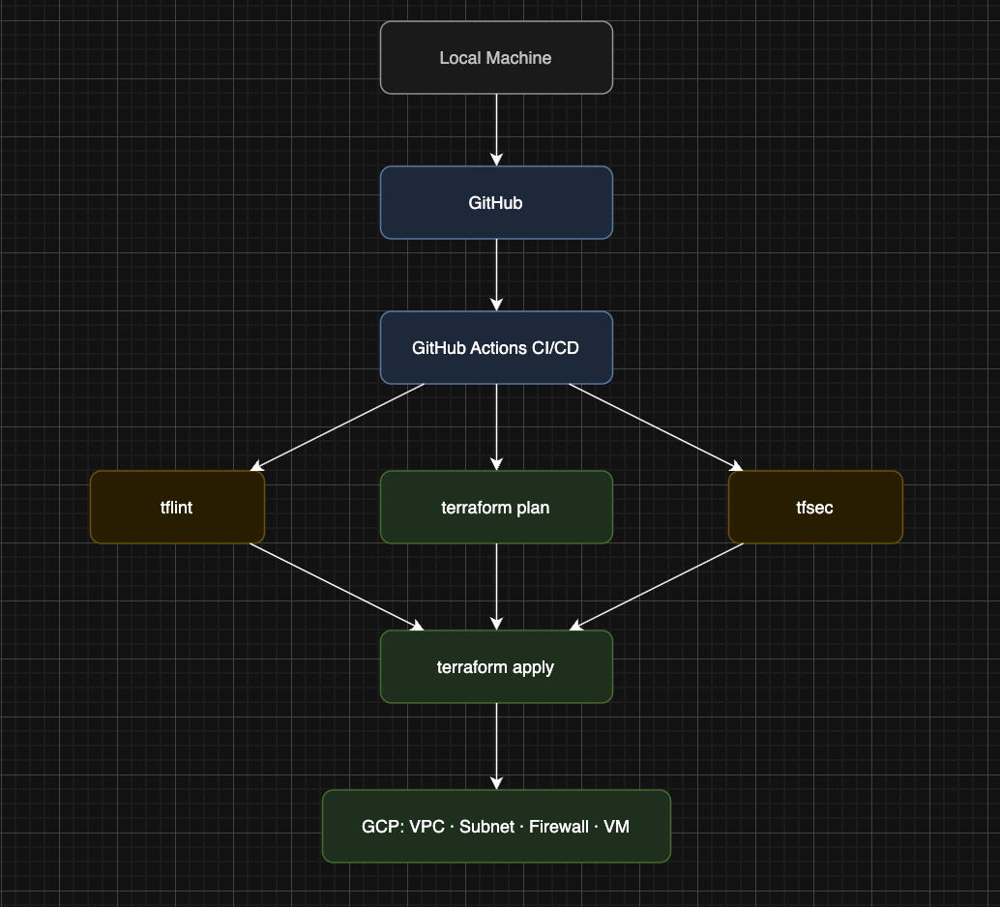

# Terraform GCP Lab

Provisions GCP cloud infrastructure using Terraform with remote state, GitHub Actions CI/CD, and tfsec/tflint security scanning.

## Architecture

## Infrastructure provisioned
- VPC network
- Subnet (us-central1)
- Firewall rule (SSH)
- Compute Engine VM (e2-micro, Debian 11)
- Remote state in GCS bucket

## Stack
- Terraform · GCP · GitHub Actions · tfsec · tflint
